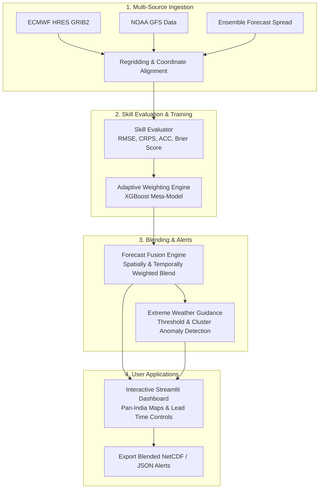

# ASTRA: Adaptive System for Temperature & Rainfall Analytics

[](https://www.python.org/)
[](https://streamlit.io/)
[](https://xgboost.readthedocs.io/)
[](LICENSE)
[]()

> **A Hybrid AI–NWP Meteorological Blending Framework** dynamically combining physical numerical weather prediction (NWP) models, ensemble spreads, and machine learning models based on lead time, geographic region, seasonal regimes, and historical skill.

---

## 📌 Problem Statement Overview

Weather forecasting systems perform differently depending on region, topography, season, lead time, and prevailing meteorological regimes:
- Physical NWP models (e.g., **ECMWF HRES**, **NOAA GFS**) excel at synoptic dynamics but can suffer from local convective biases.
- Ensemble prediction systems provide crucial spread/uncertainty estimates.
- AI/ML weather models exhibit high computational efficiency and short-lead pattern capture.

**ASTRA** solves this challenge by implementing an intelligent blending system that assigns **adaptive, space- and lead-time-variant weights** to distinct forecast sources. The end product produces an optimized, multi-variable blended forecast for **Rainfall, Temperature, and Wind**, coupled with early warning indicators for **Extreme Weather Events**.

---

## 🌟 Key Features

- **Dynamic Multi-Source Blending:** Combines ECMWF HRES, GFS, and Ensemble Spread using intelligent, learned weighting.
- **Regime & Lead-Time Adaptive Weighting:** An XGBoost gradient-boosted meta-model generates localized weights conditioned on lead time (T+06h to T+72h), season, and spatial regime.
- **Extreme Weather Guidance:** Automated detection of heavy precipitation, extreme heatwaves, and gale-force wind gusts adhering to IMD/WMO severity thresholds (Yellow, Orange, Red alerts).
- **Interactive Geospatial Dashboard:** Built with Streamlit and Plotly, supporting Pan-India national coverage, regional sub-domains (South India, Tamil Nadu), and variable switches (Rainfall, Temperature, Wind).
- **Lead-Time Trajectory Analytics:** Dynamic map updates across lead times, real-time forecast uncertainty spreads, and model skill trajectories (RMSE vs. Lead Time).
- **1-Click Automation:** Single execution batch and PowerShell scripts (`run_astra.bat` / `run_astra.ps1`) to run data processing, ML weighting, and dashboard launch in one step.

---

## 🏗️ System Architecture



---

## 📂 Repository Structure

```
ASTRA/
├── config/
│   ├── model_config.yaml         # Blending hyperparameters & weights
│   ├── regions.yaml              # Geospatial bounding boxes (India, TN, South India)
│   └── sources.yaml              # Meteorological data endpoints & variables
├── data/
│   ├── alerts.json               # Generated extreme weather guidance alerts
│   ├── learned_weights.csv       # Precomputed regional & lead-time weights
│   ├── skill_scores.csv          # Verification metrics (RMSE, CRPS, ACC)
│   └── xgb_adaptive_weighter.json# Trained XGBoost adaptive weighting model
├── src/
│   ├── dashboard/
│   │   └── app.py                # Streamlit GIS dashboard & interactive UI
│   ├── extremes/
│   │   └── guidance.py           # Extreme event thresholding and alert engine
│   ├── ingestion/
│   │   └── grib_loader.py        # GRIB2 / NetCDF parser and spatial regridder
│   ├── skill_evaluation/
│   │   └── metrics.py            # Verification algorithms (RMSE, Spread-Skill, CRPS)
│   ├── weighting/
│   │   └── model.py              # XGBoost adaptive weighting trainer & inferencer
│   └── run_pipeline.py           # End-to-end pipeline execution runner
├── airflow/
│   └── dags/
│       └── astra_pipeline_dag.py # Automated workflow orchestration DAG
├── Dockerfile                    # Containerization image definition
├── docker-compose.yml            # Multi-service container specification
├── requirements.txt              # Production Python dependencies
├── run_astra.bat                 # 1-Click execution script for Windows
├── run_astra.ps1                 # 1-Click execution script for PowerShell
└── README.md                     # Project documentation
```

---

## 🚀 Quick Start Guide

### 1. Clone the Repository
```bash
git clone https://github.com/LakshmiKanthan07/ASTRA---Adaptive-System-for-Temperature-Rainfall-Analytics.git
cd ASTRA---Adaptive-System-for-Temperature-Rainfall-Analytics
```

### 2. Set Up Virtual Environment & Dependencies
```bash
# Create virtual environment
python -m venv venv

# Activate virtual environment
# Windows:
venv\Scripts\activate
# Linux/macOS:
source venv/bin/activate

# Install requirements
pip install -r requirements.txt
```

### 3. Run with 1-Click Scripts
- **On Windows (Command Prompt):**
  ```cmd
  run_astra.bat
  ```
- **On PowerShell:**
  ```powershell
  .\run_astra.ps1
  ```

*Or execute manually in two steps:*
```bash
# Step 1: Run the end-to-end ML weighting and blending pipeline
python src/run_pipeline.py

# Step 2: Start the interactive dashboard
streamlit run src/dashboard/app.py
```
Open your browser at `http://localhost:8501`.

---

## 🖥️ Dashboard Features & Usage

1. **Top Metric Bar:** Shows active blended forecast models, peak forecast rainfall intensity, active extreme weather alert levels, and overall RMSE improvement over raw NWP.
2. **Variable Selector:** Switch seamlessly between **Rainfall (mm/day)**, **Temperature (°C)**, and **Wind Speed (m/s)**.
3. **Lead Time Controls:** Select lead times from `+06h` to `+72h`. Maps and uncertainty spreads automatically reflect dynamic forecast evolution.
4. **Geographic Domains:** Choose between **Pan-India (National)**, **South India**, or **Tamil Nadu** with automated bounding-box clipping.
5. **Model Reliability Weights:** View adaptive weighting distributions across regions and lead times.
6. **Active Severe Weather Alerts:** Review real-time warnings (Warning, Alert, Watch) categorized by IMD standards.
7. **Skill Trajectory & Uncertainty:** Track RMSE performance across forecast hours and inspect ensemble uncertainty distributions.

---

## ☁️ Cloud Deployment Options

### Option 1: Streamlit Community Cloud (Recommended & Free)
1. Fork or push this repository to GitHub.
2. Visit [share.streamlit.io](https://share.streamlit.io/) and log in with your GitHub account.
3. Click **"New App"** and select this repository.
4. Set the main file path to: `src/dashboard/app.py`.
5. Click **Deploy**.

### Option 2: Render / Hugging Face Spaces
- **Hugging Face Spaces:** Create a new Space, select **Streamlit** SDK, and link this repository.
- **Render:** Deploy as a **Web Service** with start command:
  ```bash
  streamlit run src/dashboard/app.py --server.port $PORT --server.address 0.0.0.0
  ```

### Option 3: Docker Deployment
```bash
docker-compose up --build -d
```
Access the dashboard at `http://localhost:8501`.

---

## 📄 License
This project is licensed under the MIT License - see the [LICENSE](LICENSE) file for details.
